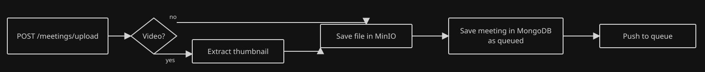
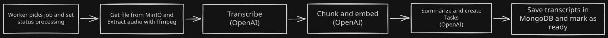

# Fireflies Backend

This is a [Hono](https://hono.dev) app on [Bun](https://bun.sh). I picked Hono because it is lightweight and fast. This API is a small set of endpoints. I did not need a heavier framework for that.

[Clerk](https://clerk.com) handles authentication. I chose Clerk because I initially planned to integrate with Google Calendar, and Clerk has a good Google OAuth integration that can provide the tokens for that kind of integration. It also gives every request a user ID. Meeting reads, writes, and AskFred searches use that ID, so one user cannot see another user's meetings.

Meetings live in [MongoDB](https://www.mongodb.com). An upload can be video or audio, and the document shape is not fixed, so a document store fits. [MongoDB Vector Search](https://www.mongodb.com/docs/atlas/atlas-vector-search/vector-search-overview/) lets us search across embeddings. [Atlas Search](https://www.mongodb.com/docs/atlas/atlas-search/) is there if we want full-text later. That is not wired up today.

Blobs go to [MinIO](https://min.io). It is S3-compatible, open source, and we run it ourselves.

[Redis](https://redis.io) backs [BullMQ](https://docs.bullmq.io). Upload should return as soon as the file is stored. ffmpeg and transcription take longer than that, so the worker runs those jobs in the background.



`POST /meetings/upload` classifies the file. Video gets a thumbnail. The blob goes to MinIO. Mongo writes a meeting as `queued`, then we push a job.



My first idea was to do the whole pipeline in the upload endpoint. You can see that version in [`e3ae153`](https://github.com/d4vz/fireflies-tech-challenge-backend/commit/e3ae1534d872806002a3317d84718900c4af9c65). No worker. That was fine for short clips. Longer videos sat on the request, sometimes timed out, and the process got heavy. [BullMQ](https://docs.bullmq.io) is built for this: enqueue the meeting id and let a worker do the slow work.

Boot starts that worker next to the HTTP server:

```ts
startMeetingsWorker(secrets.REDIS_URL, (meetingId) => processMeetingJob(processDeps, meetingId));
```

```ts
return new Worker<MeetingJobData>(
  meetingsQueueName,
  async (job) => {
    await processJob(job.data.meetingId);
  },
  { connection: redisConnection(redisUrl), concurrency: 1 },
);
```

The worker marks the meeting `processing`, pulls the file from MinIO, and extracts audio with ffmpeg. AssemblyAI transcribes the audio with speaker labels. Then we chunk the text and OpenAI embeds the chunks. OpenAI also runs a summary pass that creates takeaways and action items. Transcripts land in Mongo, the meeting is marked `ready`, and AskFred can search it.

I tried OpenAI `gpt-4o-transcribe-diarize` first. A 5-minute clip took 133 seconds to transcribe. A 10-minute clip was still running after 15 minutes, then failed. That wait was OpenAI, not the queue. I switched to AssemblyAI. The same 10-minute file transcribed in 15 seconds, at least 60 times faster, with speaker labels on the whole file. A 5-minute file took 13 seconds.

## Data

Tasks live on the meeting document. Mongo's rule is [data that is accessed together is stored together](https://www.mongodb.com/docs/manual/data-modeling/). The meeting detail and the actions list both need those tasks, so a second collection would only add lookups.

```json
{
  "_id": "68b6c2a4f1a2b3c4d5e6f789",
  "userId": "user_2abcClerkId",
  "sourceType": "upload",
  "sourceId": "q3-planning.mp4",
  "name": "Q3 planning",
  "createdAt": "2026-03-12T14:02:11.000Z",
  "status": "ready",
  "summary": {
    "text": "The team locked the Q3 launch date and split the remaining work.",
    "takeaways": ["Launch stays on 12 May.", "Design review moves to Friday."]
  },
  "tasks": [
    {
      "_id": "68b6c2a4f1a2b3c4d5e6f790",
      "text": "Send the launch brief to sales",
      "status": "pending",
      "updatedAt": "2026-03-12T14:08:40.000Z"
    }
  ],
  "blob": {
    "kind": "video",
    "url": "http://localhost:9000/fireflies/meetings/68b6c2a4f1a2b3c4d5e6f789/video",
    "durationInSeconds": 1842,
    "sizeInBytes": 248291840,
    "thumbnailUrl": "http://localhost:9000/fireflies/meetings/68b6c2a4f1a2b3c4d5e6f789/thumbnail.jpg"
  }
}
```

Transcript chunks are a different collection. Each chunk keeps its text and a 1536-dimension embedding from `text-embedding-3-small`. AskFred embeds the question with the same model. `$vectorSearch` ranks chunks by cosine similarity. A `meetingId` filter keeps a meeting-scoped search on that meeting.

I could have used [pgvector](https://github.com/pgvector/pgvector) or [Turbopuffer](https://turbopuffer.com) for vector search. I chose MongoDB Vector Search because Mongo already stores the meetings and transcript chunks. That gives us semantic search without adding another service to run.

Boot creates the index if it is missing:

```ts
await collection.createSearchIndex({
  name: "transcript_embedding",
  type: "vectorSearch",
  definition: {
    fields: [
      {
        type: "vector",
        path: "embedding",
        numDimensions: 1536,
        similarity: "cosine",
      },
      { type: "filter", path: "meetingId" },
    ],
  },
});
```

## Models

Transcription uses [AssemblyAI](https://www.assemblyai.com). The name in [config.yaml](config.yaml) is `assemblyai`. Summaries, embeddings, and chat still use [OpenAI](https://platform.openai.com). You still need `OPENAI_API_KEY`. The default config needs both keys. Set `models.transcribe` to `gpt-4o-transcribe-diarize` to use OpenAI for transcription. Then `ASSEMBLYAI_API_KEY` can stay empty.

AskFred uses the [AI SDK](https://ai-sdk.dev) because it provides a simple interface for adding tools and other agent capabilities. It is also provider-agnostic: to switch providers later, we only need to pass a different model implementation.

## Run

You need [Docker](https://docs.docker.com/get-docker/) and [Bun](https://bun.sh). You also need an [OpenAI](https://platform.openai.com) API key, an [AssemblyAI](https://www.assemblyai.com) API key, and a [Clerk](https://clerk.com) secret key.

```
curl -fsSL https://bun.sh/install | bash
```

I used the Atlas local image so `$vectorSearch` works on your machine. ffmpeg is already in the API image.

The parent repository can start this file together with the frontend. From the parent root, copy `.env.example` to `.env` and run `docker compose up --build`.

To start only the backend:

```
cp .env.example .env
```

Fill in `OPENAI_API_KEY`, `ASSEMBLYAI_API_KEY`, and `CLERK_SECRET_KEY`. Then start the whole backend:

```
docker compose up --build
```

The API listens on `http://localhost:3000`.

To run Hono on the host with live reload, start only the data stores, install [ffmpeg](https://ffmpeg.org), then use `bun run dev`. `.env` already points at those compose ports.

```
docker compose up -d mongodb redis minio
bun install
bun run dev
```
